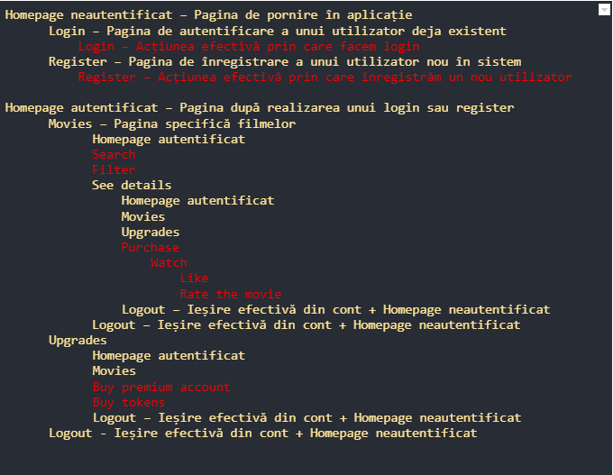

# OOP TV

This is a simple backend for a movie streaming service. It is a work in progress, but this version
is stable and can be used for a small scale project. The backend is written in Java and uses
multiple design patterns. The frontend is not yet implemented, but might be in the future.

## The following design patterns are used:
- Singleton
- Factory

1. The following classes are implemented using the Singleton design pattern:
- HomePageAuthenticated
- HomePageNotAuthenticated
- Login
- Logout
- Movies
- Register
- SeeDetails
- Upgrades

2. The following classes are implemented using the Factory design pattern:
- UserFactory

## The classes are divided into the following packages:
- input - contains the classes that read facilitate the reading of data from JSON files
- database - contains the classes that implement the database
- movie - contains the classes that implement the movie objects
- user - contains the classes that implement the user objects
- pages - contains the classes that implement the pages of the website

The following classes are implemented using the Factory design pattern:
- UserFactory

The classes are scalable and can be used for a large scale project.

If you are not interested in the detailed implementation, you can skip to the next section.

- The pages are implemented using the singleton design pattern. This means that only one instance
  of each page can be created. This is useful because we don't want to have multiple instances of
  the same page. For example, if we have multiple instances of the HomePageAuthenticated page, then
  the flow of the program will be messed up and will not be able to keep track of the user's
  authentication status. The same goes for the other pages.
- Each page has a constructor that takes in a string as a parameter. You cannot modify the
  name a page has through the constructor. This is because the name of the page is set when the
  page is created. You can only get an instance of a page by calling the getInstance() method.
  This is done to ensure security and to prevent bugs.
- Alongside the singleton specific methods, each page has a method called action()
  that takes an ActionInput object containing all the data needed to perform the action, and
  a database object. The action() method has a different implementation for each page, depending
  on the action(s) that page can perform. For example, the Login page can perform the login action,
  so in the action() method of the Login page, we check take care of the login specific logic.
- One downside of the current implementation is that the database is not a singleton object
  since It's not yet thread safe. This means that the database object is passed as a parameter to
  the action() method of each page. This is not ideal, but it is the best solution for now.
- There are multiple checks for the validity of the data passed to the action() before calling
  the action() method and also in the action() method itself. This is done to prevent bugs and
  to ensure security.
- At a first glance, the code might seem a bit messy, but it is actually very well organized.
  In the future, I will try to make it even more organized by splitting the long main method
  into smaller methods and by adding more comments. I recommend reading the code with the
  blocks minimized. This will make it easier to read.

There are 2 types of users: standard and premium. The standard user can only watch movies
he bought with the platform's currency. The premium user has access to 15 movies for free,
along with the movies he bought.

Each page has its own class, with a different implementation of the action method. The action method
is called when a user gives a command to the website that is relevant to the page. The action method
then takes care of the command and returns a JSON object that contains the information that result.
The yellow words are the pages. The red words are the commands. The hierarchy of the pages is the
following:

    Homepage neautentificat:
            - Login
            - Register
    Homepage autentificat:
            - Movies:
                    - Homepage autentificat
                    - SeeDetails
                    - Upgrades
                    - Logout
            - Upgrades:
                    - Homepage autentificat
                    - SeeDetails
                    - Logout
            - Logout

As you can see from the visual aid provided above, the user can access certain pages
only from pages that have the "parent" role.

In order to use the backend, you need to call the main method from the Main class while
parsing an input JSON file and an output JSON file. The format can be seen in the example:

    {
    "users": [
            {
            "credentials": {
                "name": "Eduard",
                "password": "secret",
                "accountType": "standard",
                "country": "Romania",
                "balance": "200"
                }
            },
            {
            "credentials": {
                "name": "Mihail",
                "password": "discret",
                "accountType": "premium",
                "country": "Russia",
                "balance": "1337"
            }
         }
    ],
    "movies": [
        {
            "name": "John Wick: Chapter 3 - Parabellum",
            "year": "2019",
            "duration": 131,
            "genres": [
                "Action",
                "Thriller",
                "Crime"
            ],
            "actors": [
                "Laurence Fishburne",
                "Halle Berry",
                "Keanu Reeves"
            ],
            "countriesBanned": [
                "Russia"
            ],
        },
        {
            "name": "Titanic",
            "year": "2019",
            "duration": 131,
            "genres": [
                "Action",
                "Thriller",
                "Crime"
            ],
                "actors": [
                "Laurence Fishburne",
                "Halle Berry",
                "Keanu Reeves"
            ],
            "countriesBanned": [
                "Russia"
            ]
        }
    ],
    "actions": [
        {
            "type": "change page",
            "page": "login"
        },
        {
            "type": "on page",
            "feature": "login",
            "credentials": {
                "name": "Eduard",
                "password": "parolamea"
            }
        },
        {
            "type": "change page",
            "page": "register"
        }
        }
    ]

The output is a JSON file that contains the information that the user requested. The format is
similar.

In the end if you are interested in the implementation, you can check the code. If you are not
interested in the implementation, I recommend you to check the code anyway. It's not that bad.

Thoughts and feedback are welcome. I am open to suggestions, and I am willing to improve the code.

Till next time.

Stay classy :P

- A word from our sponsor:

  

  RAID: Shadow Legends™️ is an immersive online experience with everything you'd expect from a brand new RPG title. It's got an amazing storyline, awesome 3D graphics, giant boss fights, PVP battles, and hundreds of never before seen champions to collect and customize.
  
  I never expected to get this level of performance out of a mobile game. Look how crazy the level of detail is on these champions!
  
  RAID: Shadow Legends™️ is getting big real fast, so you should definitely get in early. Starting now will give you a huge head start. There's also an upcoming Special Launch Tournament with crazy prizes! And not to mention, this game is absolutely free!
  
  So go ahead and check out the video description to find out more about RAID: Shadow Legends™️. There, you will find a link to the store page and a special code to unlock all sorts of goodies. Using the special code, you can get 50,000 Silver immediately, and a FREE Epic Level Champion as part of the new players program, courtesy of course of the RAID: Shadow Legends™️ devs.